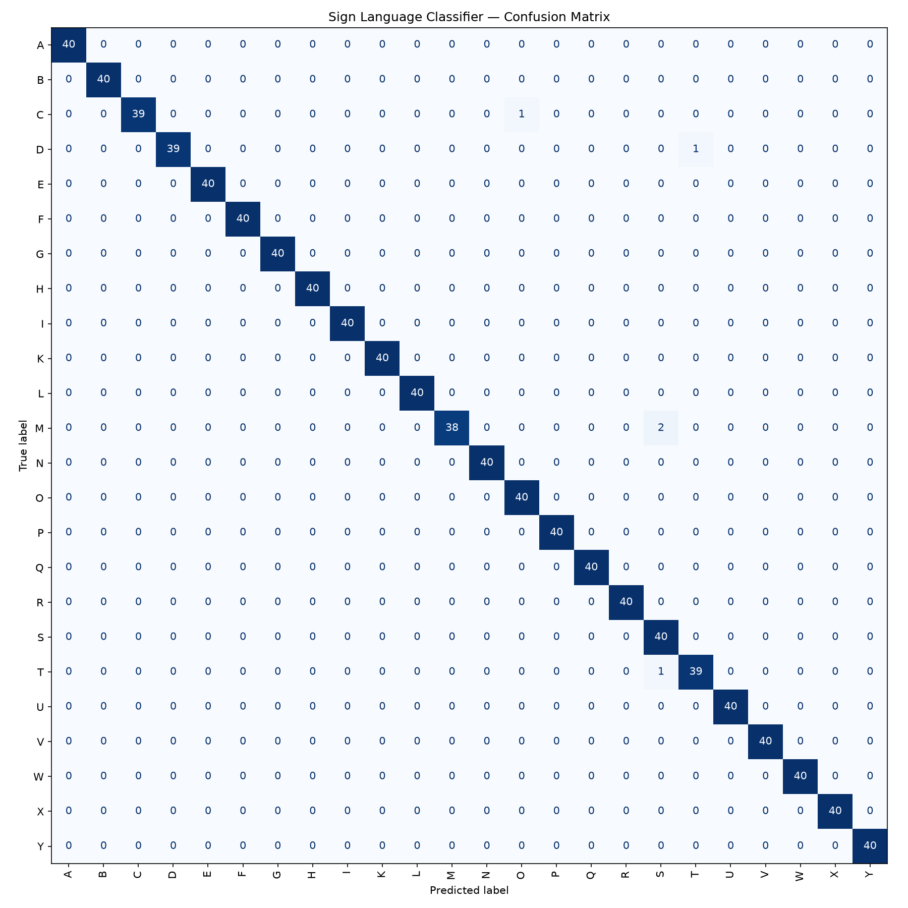

# Sign Language to Speech Translator

A real-time system that recognizes hand signs (ASL alphabet) using a webcam and translates them into spoken text. Built as a 3rd semester academic project.

## How it works

1. **Webcam** captures live video
2. **MediaPipe Hands** detects 21 hand landmarks per frame
3. Landmarks are converted into a **63-number feature vector**
4. A **Random Forest classifier** predicts which sign is being shown
5. The prediction is displayed as text and **spoken aloud** using text-to-speech

## Results

- 24 signs recognized (ASL alphabet A-Y, excluding J and Z which require motion)
- ~99% accuracy on held-out test data
- See `confusion_matrix.png` for the full per-letter breakdown



## Tech stack

- Python
- OpenCV — webcam capture and display
- MediaPipe — hand landmark detection
- scikit-learn — Random Forest classifier
- pyttsx3 — offline text-to-speech

## Project structure

| File | Purpose |
|---|---|
| `collect_data.py` | Records labeled hand landmark samples for training |
| `train_model.py` | Trains the Random Forest classifier |
| `evaluate_model.py` | Generates accuracy report and confusion matrix |
| `run_app.py` | Real-time recognition app with speech output |
| `landmark_data.csv` | Collected training dataset |
| `sign_model.pkl` | Trained model file |

## How to run it

```bash
python -m venv venv
venv\Scripts\activate        # Windows
pip install opencv-python mediapipe numpy scikit-learn pandas pyttsx3 matplotlib
python run_app.py
```

Hold a hand sign steady in front of your webcam. The recognized letter is shown on screen and spoken aloud. Press `c` to clear the built word, `q` to quit.

## Limitations

- Single-hand, static poses only (no motion-based signs like J or Z)
- Trained primarily on one person's hand — accuracy may drop for other users or different lighting/backgrounds
- Works best against a plain background with good lighting

## Future improvements

- Add motion-based signs
- Support two-handed signs
- Expand vocabulary beyond the alphabet to common words
- Add a proper GUI instead of raw OpenCV windows
